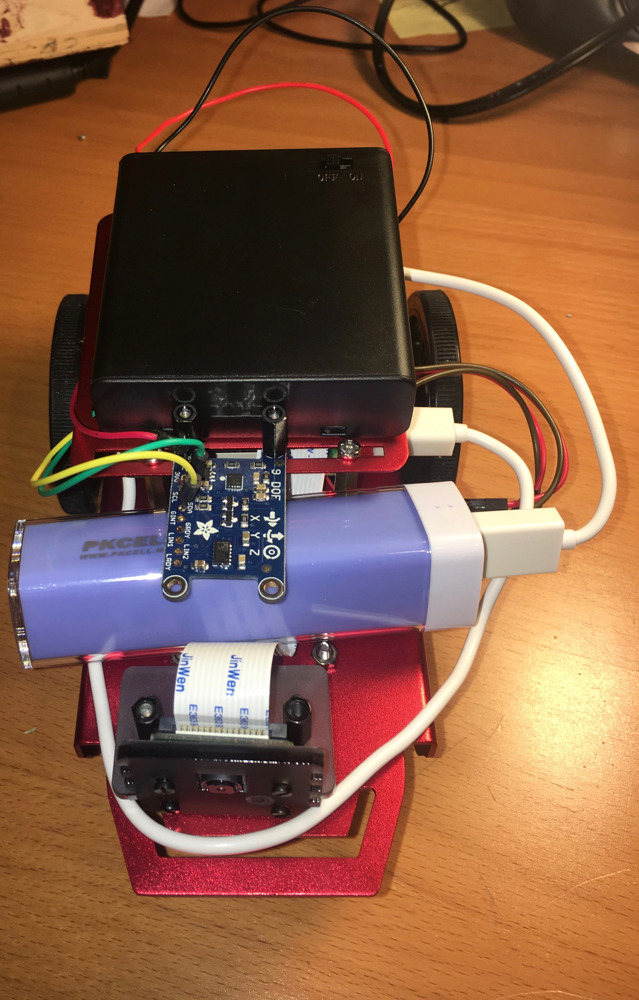
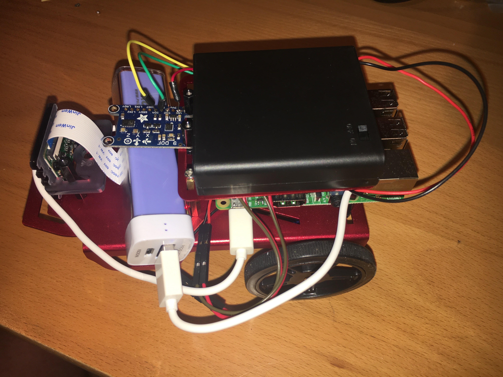

# Robotics: Capstone
## Submission for week 2
### Front picture:

### Side picture: 

Note that ground (black) wire for the IMU runs UNDER the top plate of the chassis
### 6 second video of robot moving at 0.3 m/s
[YouTube link](https://youtu.be/3bbs68VyW4w "First Video")
